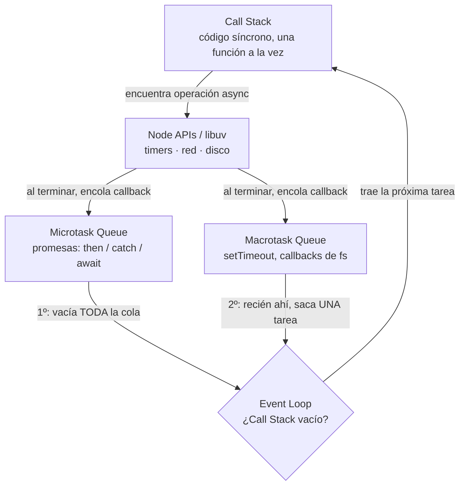

# Clase 2 — Asincronismo: callbacks, promesas y async/await

## Objetivos de la clase

- Entender por qué Node es asíncrono y no bloqueante.
- Recorrer la evolución callbacks → promesas → async/await, y por qué existe cada paso.
- Poder consumir una API externa en serie y en paralelo, con manejo de errores.

## 1. El Event Loop

Node corre JS en **un solo hilo**: en todo momento solo se puede estar ejecutando una línea de código. Si una operación (leer un archivo, esperar una respuesta de red) bloqueara ese hilo hasta terminar, el servidor no podría atender nada más mientras tanto. La pregunta es: ¿cómo hace Node para "esperar" una respuesta de red sin quedarse trabado? Ahí entra el **Event Loop**.

Piezas del modelo (simplificado):

- **Call Stack**: donde se ejecuta el código síncrono, función tras función, como en cualquier lenguaje.
- **APIs de Node / libuv**: cuando el código pide algo lento (un timer, leer un archivo, un `fetch`), Node no lo resuelve en el Call Stack — se lo delega a libuv, que lo maneja por fuera (usando el sistema operativo o un pool de threads interno) y sigue ejecutando el código que viene después, **sin esperar**.
- **Microtask Queue**: cuando una promesa se resuelve o rechaza, su callback (`.then`, `.catch`, o lo que sigue de un `await`) no se ejecuta al toque — se encola acá.
- **Callback / Macrotask Queue**: los callbacks de `setTimeout`, operaciones de `fs`, y similares, se encolan acá cuando terminan.
- **El Event Loop en sí**: es un bucle que constantemente pregunta *"¿el Call Stack está vacío?"*. Cuando sí, primero vacía **toda** la Microtask Queue (una por una, incluso si se van agregando más microtasks mientras tanto), y recién después saca **una** tarea de la Macrotask Queue. Y así indefinidamente.



*(si tu editor no renderiza Mermaid, instalá la extensión "Markdown Preview Mermaid Support" en VSCode, o mirá el archivo directamente en GitHub)*

```

En criollo: **el código síncrono siempre corre primero y completo. Después, las promesas. Por último, los timers/callbacks de I/O.** Esto explica un resultado que suele sorprender:

```js
console.log("1");
setTimeout(() => console.log("2"), 0);
Promise.resolve().then(() => console.log("3"));
console.log("4");

// Orden real: 1, 4, 3, 2
```

Aunque el `setTimeout` tiene `0` milisegundos, igual se ejecuta **después** del `.then` de la promesa — porque las microtasks (promesas) siempre se procesan antes que la siguiente macrotask (timers), apenas el Call Stack queda libre.

**Por qué importa en la práctica:** como todo corre en un solo hilo, un cálculo síncrono pesado (un loop enorme, parsear un archivo gigante de forma síncrona) bloquea el Call Stack — y mientras eso pasa, el Event Loop no puede atender nada más: ni resolver promesas, ni disparar timers, ni responder otras requests si esto corriera dentro de un servidor. De ahí la importancia de nunca hacer trabajo pesado de forma síncrona en el hilo principal.

## 2. Callbacks

Un callback es una función que se pasa como argumento para ser ejecutada cuando termine una operación.

```js
fs.readFile("libros.json", "utf-8", (error, data) => {
  if (error) {
    console.error("Falló la lectura:", error);
    return;
  }
  console.log(data);
});
```

Problema: si necesito encadenar varias operaciones asíncronas, los callbacks se anidan cada vez más — el famoso **callback hell**:

```js
leerArchivo((error, data) => {
  procesarDatos(data, (error, resultado) => {
    guardarResultado(resultado, (error) => {
      // y así...
    });
  });
});
```

Difícil de leer, difícil de manejar errores (hay que chequearlos en cada nivel).

## 3. Promesas

Una **Promise** representa el resultado futuro de una operación asíncrona. Tiene tres estados: `pending` (todavía no terminó), `fulfilled` (terminó bien) o `rejected` (terminó con error).

```js
fetch("https://openlibrary.org/isbn/9780307474728.json")
  .then((response) => response.json())
  .then((data) => console.log(data.title))
  .catch((error) => console.error("Error:", error))
  .finally(() => console.log("Terminó, haya salido bien o mal"));
```

`.then` encadena sin anidar. `.catch` atrapa cualquier error que haya ocurrido en la cadena. Esto ya resuelve el callback hell, pero sigue siendo un poco verboso.

## 4. Async / await

`async/await` es azúcar sintáctica sobre promesas: permite escribir código asíncrono con la forma de código síncrono.

```js
async function obtenerLibro(isbn) {
  const response = await fetch(`https://openlibrary.org/isbn/${isbn}.json`);
  const data = await response.json();
  return data.title;
}
```

Reglas clave:

- `await` solo se puede usar **dentro de una función `async`**.
- Una función `async` **siempre devuelve una Promise**, aunque el `return` de adentro sea un valor normal.
- Para manejar errores se usa `try/catch`, como en código síncrono:

```js
async function obtenerLibro(isbn) {
  try {
    const response = await fetch(`https://openlibrary.org/isbn/${isbn}.json`);
    if (!response.ok) throw new Error(`ISBN no encontrado: ${isbn}`);
    const data = await response.json();
    return data.title;
  } catch (error) {
    console.error("No se pudo obtener el libro:", error.message);
    return null;
  }
}
```

**Importante:** si una promesa se rechaza y nadie la atrapa (ni `.catch` ni `try/catch`), Node tira un warning de "unhandled promise rejection" — y en versiones recientes puede directamente tirar abajo el proceso. Nunca dejar una promesa "suelta".

## 5. Secuencial vs paralelo

Si hay que esperar varias operaciones que **no dependen entre sí**, hacerlas una por una con `await` desperdicia tiempo:

```js
// Secuencial — tarda la suma de los tres tiempos
const libro1 = await obtenerLibro("isbn1");
const libro2 = await obtenerLibro("isbn2");
const libro3 = await obtenerLibro("isbn3");
```

```js
// Paralelo — tarda lo que tarde la más lenta de las tres
const [libro1, libro2, libro3] = await Promise.all([
  obtenerLibro("isbn1"),
  obtenerLibro("isbn2"),
  obtenerLibro("isbn3"),
]);
```

`Promise.all` espera a que todas terminen bien; si **una sola** se rechaza, `Promise.all` se rechaza entera (aunque las demás hayan salido bien). Cuándo usar cada una: secuencial cuando un paso depende del resultado del anterior, paralelo cuando son independientes.
