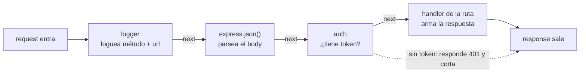

# Clase 5 — Middlewares y diseño REST

## Objetivos de la clase

- Entender **qué es un middleware** de verdad: la firma, `next()`, el orden, los tipos — y por qué el patrón aparece en casi todos los frameworks web, no solo en Express.
- Diseñar una API REST con criterio: nombrar recursos, elegir el verbo y el **status code** correctos, usar **query params** para filtrar / ordenar / paginar.
- Definir un **formato de error estandarizado** y aplicarlo en toda la API.
- Refactorizar el CRUD de la clase 4 (todo en `index.js`) a una estructura con **`routes/` y `controllers/`**.

## 1. Dónde estamos

En la clase 4 el `index.js` terminó así: todo junto — el array de datos, las 5 rutas, la validación, el manejo del `404` repetido en cada handler. Funciona, pero:

- cada handler repite `const libro = libros.find(...)` y el mismo `if (!libro) return res.status(404)...`;
- el formato del error cambia según quién lo escribió (`{ error: "..." }` en un lado, `{ mensaje: "..." }` en otro);
- agregar un recurso nuevo (`/autores`) significa seguir amontonando en el mismo archivo.

Hoy lo ordenamos. Pero antes, la pieza que hace falta entender para todo lo que sigue: el **middleware**.

## 2. Qué es un middleware

Un **middleware** es una función que se mete **en el medio** del camino entre que llega el request y que sale la response. Express procesa cada request pasándola por una **fila de funciones**, una atrás de otra. Cada una recibe el request, puede hacer algo con él, y decide si la fila sigue o se corta ahí.



*(si tu editor no renderiza Mermaid, instalá la extensión "Markdown Preview Mermaid Support" en VSCode, o mirá el archivo directamente en GitHub)*

### La firma

Un middleware es una función de **3 parámetros**:

```js
function miMiddleware(req, res, next) {
  // ...
}
```

- `req` — el request. Podés leerlo y **agregarle cosas** (`req.usuario = ...`) para que los siguientes las usen.
- `res` — la response. Podés responder desde acá y cortar la fila.
- `next` — una función. Llamarla (`next()`) significa *"terminé, pasá al siguiente de la fila"*.

### Las tres cosas que puede hacer

1. **Hacer algo y seguir**: toca `req`/`res` y llama a `next()`. Ej: el logger — imprime y sigue.
2. **Responder y cortar**: llama a `res.json(...)` / `res.status(...).end()` y **no** llama a `next()`. La fila termina ahí. Ej: un middleware de auth que rechaza con `401`.
3. **Pasar un error**: llama a `next(err)` con un argumento. Express saltea todos los middlewares normales y va directo al **error handler** (ver punto 5 y clase 6).

> Regla de oro: un middleware **siempre** termina llamando a `next()`, o respondiendo. Si no hace ninguna de las dos, el request queda colgado para siempre y el cliente espera hasta que se corta por timeout.

### El orden es el que vos escribís

Express arma la fila en el **orden en que registrás los middlewares**. Por eso:

```js
app.use(logger);          // 1º: se ejecuta primero
app.use(express.json());  // 2º: cuando llega acá, el body todavía no se parseó arriba
app.use("/libros", librosRouter); // 3º
app.use(errorHandler);    // último: los error handlers van al final
```

Si ponés `express.json()` **después** de una ruta que usa `req.body`, esa ruta va a ver `req.body` vacío. El orden importa siempre.

### `app.use` vs `app.get` / `app.post`

- `app.use(fn)` — registra `fn` para **todos** los métodos y (si no le pasás path) **todas** las rutas.
- `app.use("/libros", fn)` — solo para rutas que **empiezan** con `/libros`.
- `app.get("/libros", fn)` — `fn` solo para `GET /libros` exacto.

En el fondo **son todos lo mismo**: un handler de ruta como `app.get("/libros", (req, res) => {...})` es un middleware que resulta ser el último de la fila (responde y no llama a `next()`). "Middleware" y "handler" no son cosas distintas — es la misma función en distinto lugar de la fila.

### Los tipos de middleware que vas a usar

| Tipo | Ejemplo | Para qué |
|---|---|---|
| **De aplicación** | `app.use(logger)` | corre en todas las requests |
| **De router** | `librosRouter.use(...)` | corre solo en las rutas de ese router |
| **De librería / terceros** | `express.json()`, `cors()`, `helmet()` | funcionalidad ya hecha que enchufás |
| **Error handler** | `app.use((err, req, res, next) => {...})` | **4 parámetros** — Express lo reconoce por eso; centraliza errores (clase 6) |
| **Built-in** | `express.json()`, `express.static()` | vienen con Express |

## 3. ¿"Middleware" es solo de Express?

No. El patrón —*"el request pasa por una cadena de funciones, cada una puede actuar, cortar o delegar"*— existe en casi todos los frameworks web, con **otros nombres**:

| Plataforma | Cómo se llama |
|---|---|
| **Express / Koa / Fastify** (Node) | middleware |
| **ASP.NET Core** (C#) | middleware — casi idéntico: `app.Use(async (context, next) => ...)` |
| **Ruby on Rails** | Rack middleware |
| **Django** (Python) | middleware |
| **Flask / FastAPI** (Python) | `before_request` / `after_request`, dependencies |
| **Spring** (Java) | Servlet Filters, `HandlerInterceptor` |
| **Laravel / Slim** (PHP) | middleware (estándar PSR-15) |
| **Go** (`net/http`) | handler wrapping: `func(http.Handler) http.Handler` |

Es una variante del patrón de diseño **cadena de responsabilidad** (chain of responsibility) / **pipeline**. Si entendés cómo funciona en Express, lo vas a reconocer en cualquier stack: la idea de "capas que envuelven al handler" (logging, auth, compresión, CORS, rate limiting) es universal en desarrollo web.

## 4. Diseño REST con criterio

Ya sabés los verbos y los status codes de la clase 4. Ahora, cómo se diseña una API que no dé vergüenza.

### Nombrar los recursos

- **Sustantivos, en plural**: `/libros`, `/autores`, `/prestamos`. No `/traerLibros` ni `/libro`.
- **El verbo lo pone HTTP, no la URL**: `GET /libros` para listar, no `GET /libros/listar`. Si ves un verbo en la URL, algo está mal.
- **Jerarquía para relaciones**: `GET /autores/5/libros` = "los libros del autor 5".
- **El identificador va en el path**: `/libros/5`. Los **filtros y opciones** van en la query string: `/libros?autor=orwell`.

### El status code correcto para cada caso

| Situación | Status |
|---|---|
| `GET` de una lista o un recurso que existe | `200 OK` |
| `POST` que crea un recurso | `201 Created` |
| `PUT` / `PATCH` que actualiza y devuelve el recurso | `200 OK` |
| `DELETE` exitoso sin cuerpo de respuesta | `204 No Content` |
| El body / los params están mal o faltan | `400 Bad Request` |
| Falta autenticación (sin token o inválido) | `401 Unauthorized` |
| Autenticado pero sin permiso | `403 Forbidden` |
| El recurso pedido no existe | `404 Not Found` |
| Conflicto (ej: crear algo con un `isbn` que ya existe) | `409 Conflict` |
| Excepción no controlada en tu código | `500 Internal Server Error` |

La regla de la clase 4 sigue: **4xx es culpa del cliente, 5xx es culpa tuya.** Y nunca `200` con un error adentro.

### Query params: filtrar, ordenar, paginar

Todo lo que no es "qué recurso" va en la query string. Convenciones habituales:

```
GET /libros?autor=orwell           filtrar por campo
GET /libros?sort=titulo            ordenar ascendente por titulo
GET /libros?sort=-stock           ordenar descendente (el "-" adelante)
GET /libros?page=2&limit=10       paginar: página 2, de a 10
```

Todo lo que llega en `req.query` es **string** (`req.query.limit` es `"10"`, no `10`) — hay que convertir. Y conviene poner **defaults** razonables: si no mandan `page`, es la 1; si no mandan `limit`, un número fijo (ej: 20).

```js
const page = Number(req.query.page) || 1;
const limit = Number(req.query.limit) || 20;
const desde = (page - 1) * limit;
const pagina = libros.slice(desde, desde + limit);
```

## 5. Formato de error estandarizado

Si cada endpoint devuelve los errores con una forma distinta, el que consume la API se vuelve loco. Hay que elegir **un** formato y respetarlo en todos lados.

Uno simple y común:

```json
{
  "error": {
    "code": "LIBRO_NO_ENCONTRADO",
    "message": "No existe un libro con id 999"
  }
}
```

- `code` — un string estable, pensado para que **el código del cliente** haga `if`. No cambia aunque cambie el texto.
- `message` — texto para un humano (un dev mirando la consola, un log).
- (más adelante podés sumar `details` para errores de validación con varios campos — eso llega con Zod en la clase 6.)

En esta clase lo aplicamos **a mano en cada controller**: cuando algo falla, `res.status(404).json({ error: { code: "...", message: "..." } })`. En la **clase 6** esto se centraliza en un **error handler** (`(err, req, res, next)`) para no repetir el `res.status(...).json(...)` en cada lado — hoy sentamos el formato, la próxima lo automatizamos.

## 6. Refactor: `routes/` y `controllers/`

El objetivo: que `index.js` no sepa nada de libros. Solo arma la app, engancha los middlewares globales y monta los routers.

```
biblioteca-api-express/
├── index.js               # arma la app, middlewares globales, monta routers
├── data/
│   └── libros.js           # el array en memoria (por ahora)
├── routes/
│   └── librosRoutes.js     # QUÉ ruta llama a QUÉ función
├── controllers/
│   └── librosController.js # la lógica de cada endpoint
└── middlewares/
    ├── logger.js
    └── notFound.js
```

### El router: solo dice qué llama a qué

```js
// routes/librosRoutes.js
const express = require("express");
const router = express.Router();
const controller = require("../controllers/librosController");

router.get("/", controller.listar);
router.get("/:id", controller.obtener);
router.post("/", controller.crear);
router.put("/:id", controller.actualizar);
router.delete("/:id", controller.eliminar);

module.exports = router;
```

`express.Router()` es un "mini-app": agrupa rutas relacionadas y después se monta bajo un path. Fijate que acá las rutas son `/` y `/:id`, no `/libros` — el prefijo `/libros` lo pone `index.js` al montarlo.

### El controller: la lógica, sin saber de rutas

```js
// controllers/librosController.js
const libros = require("../data/libros");

function listar(req, res) {
  res.status(200).json(libros);
}

function obtener(req, res) {
  const libro = libros.find((l) => l.id === Number(req.params.id));
  if (!libro) {
    return res.status(404).json({
      error: { code: "LIBRO_NO_ENCONTRADO", message: `No existe un libro con id ${req.params.id}` },
    });
  }
  res.status(200).json(libro);
}

// ... crear, actualizar, eliminar

module.exports = { listar, obtener, crear, actualizar, eliminar };
```

### `index.js`: chico y aburrido (así debe ser)

```js
const express = require("express");
const librosRoutes = require("./routes/librosRoutes");
const logger = require("./middlewares/logger");
const notFound = require("./middlewares/notFound");

const app = express();

app.use(logger);
app.use(express.json());

app.use("/libros", librosRoutes); // acá se pega el prefijo

app.use(notFound); // ninguna ruta matcheó → 404 estandarizado

app.listen(3000, () => console.log("http://localhost:3000"));
```

### Qué NO hacemos todavía

El controller sigue hablando **directo** con el array (`libros.find(...)`, `libros.push(...)`). No hay "casos de uso" ni "DAO" todavía — eso es la clase 7 y 8. Hoy solo separamos **routing** de **lógica de handler**. Es un paso, no el destino.

## Cierre

Middlewares (qué son, la fila, `next()`, los tipos, y que el patrón es universal), diseño REST (recursos, status codes, query params), formato de error único, y el CRUD partido en `routes/` + `controllers/` + `middlewares/`. La clase 6 suma validación con Zod y centraliza el manejo de errores en un solo middleware.
