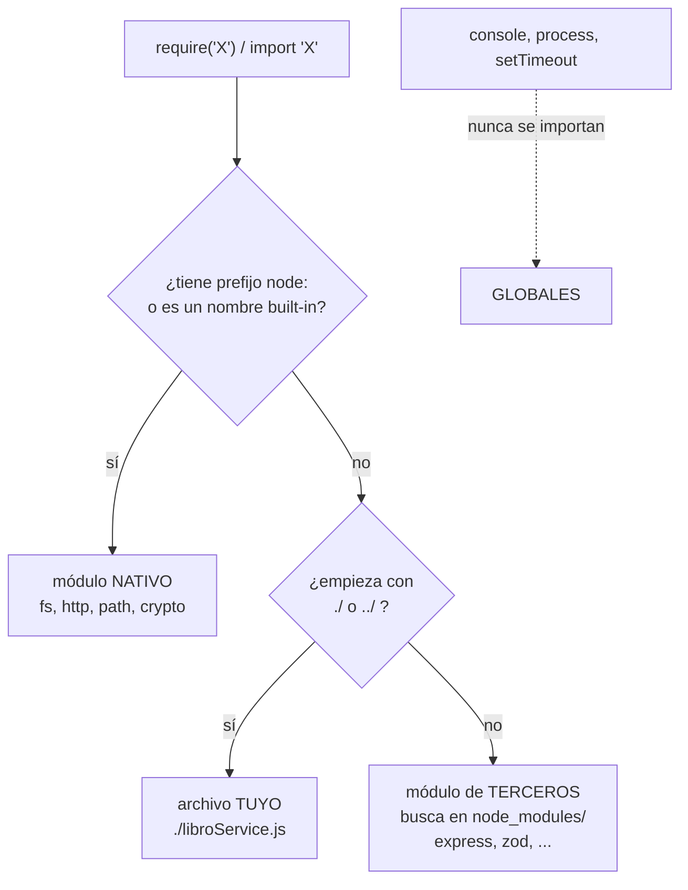

# Clase 4 — Express y APIs REST

## Objetivos de la clase

- Cerrar el tema módulos con una clasificación que nos faltaba: de dónde sale cada cosa que usamos (`console`, `fs`, `express`).
- Entender qué es `--watch` y qué significan el `^` y el `~` que aparecen solos en el `package.json`.
- Sacarnos de encima la confusión entre **API**, **API REST** y **API RESTful**, y repasar HTTP (verbos, status codes).
- Dar el salto de `http` puro (clase 3) a **Express**: routing, `req`/`res`, `express.json()` para el body.
- Construir un **CRUD completo en memoria, todo en un archivo** — a propósito sin capas todavía.

> El sistema de **middlewares** de Express (qué son, cómo se encadenan, `next()`, el error handler) es el tema central de la **clase 5**. Hoy lo tocamos de refilón, solo lo justo para que `req.body` funcione.

## 1. Módulos, otra vez: la clasificación por origen

En la clase 3 vimos los dos **sistemas** de módulos (CommonJS con `require`, ES Modules con `import`) y las diferencias entre ellos. Eso era la *sintaxis*. Hoy vemos otra pregunta, ortogonal a esa: **de dónde sale** lo que importamos. Todo lo que usamos en Node cae en una de tres categorías.

### Globales — no se importan

Están disponibles en cualquier archivo sin escribir una sola línea de `require`/`import`. Son parte del entorno, igual que `window` en el navegador.

```js
console.log("hola");           // console: objeto global
process.env.PORT;              // process: info del proceso actual
setTimeout(() => {}, 1000);    // timers: globales
```

Cuando hacemos `console.log`, no estamos usando "el módulo de la consola" — estamos usando el objeto global `console`. (Node *sí* tiene un módulo `node:console` por dentro, pero nunca lo vas a requerir a mano; el global ya te lo da resuelto.) Lo mismo con `process`: es el objeto que representa al proceso de Node que está corriendo tu programa ahora mismo — de ahí sale `process.env` (variables de entorno) y `process.exit()`.

### Nativos / built-in — vienen con Node, pero se importan

Son módulos que trae la instalación de Node, sin instalar nada, pero que hay que pedir explícitamente. Ya usamos varios en la clase 3:

```js
const fs = require("node:fs/promises");   // file system
const http = require("node:http");        // servidor HTTP puro
const path = require("node:path");        // manejo de rutas de archivos
const crypto = require("node:crypto");    // hashing, uuid, etc.
```

> El prefijo `node:` es opcional (`require("fs")` funciona igual) pero es la forma recomendada hoy: deja claro de un vistazo que es un built-in y no un paquete de `node_modules`.

### De terceros — se instalan desde npm

No vienen con Node. Los instalás con `npm install`, quedan en `node_modules/`, y se anotan en `package.json`. El de esta clase:

```bash
npm install express
```

```js
const express = require("express");
```



*(si tu editor no renderiza Mermaid, instalá la extensión "Markdown Preview Mermaid Support" en VSCode, o mirá el archivo directamente en GitHub)*

## 2. `--watch`: reinicio automático en desarrollo

En la clase 3, cada vez que cambiabas el `servidor-http/index.js` tenías que cortar el proceso (`Ctrl+C`) y volver a correr `node index.js` a mano. Tedioso. Para eso existe `--watch`.

**Qué es**: no es una función ni un evento que vos programás. Es una **bandera de línea de comandos del ejecutable `node`** — una opción que le pasás al runtime cuando lo arrancás, igual que `--version`. `node --watch index.js` le dice a Node: *"arrancá `index.js`, y además quedate vigilando los archivos; reiniciá el proceso cuando alguno cambie"*.

**Qué hace por debajo**:

1. Arranca tu programa normalmente.
2. Arma una lista de los archivos que tu proceso **efectivamente cargó**: el entry point y cada archivo que se hizo `require`/`import` desde ahí. No vigila "toda la carpeta" — solo lo que se importó.
3. Le pide al sistema operativo que le avise cuando alguno de esos archivos cambie (usa el mecanismo nativo del SO: FSEvents en macOS, inotify en Linux — lo mismo que usa `fs.watch()` por dentro).
4. Cuando llega el aviso de cambio, Node **mata el proceso actual y lo vuelve a arrancar de cero**. No es "hot reload": es un reinicio completo. Todo lo que había en memoria se pierde.

Ese último punto importa hoy: nuestro CRUD guarda los libros en un array en memoria. Con `--watch`, **cada vez que guardes el archivo, la lista de libros vuelve al estado inicial**. Es esperable — no es un bug.

**De dónde viene**: es, básicamente, un `nodemon` incorporado. Antes de Node 18.11 había que instalar `nodemon` como dependencia de desarrollo para tener esto; desde Node 20.13 (y 22) `--watch` es nativo y estable.

**Por qué va en el script `dev` y no en `start`**:

```json
"scripts": {
  "start": "node index.js",
  "dev": "node --watch index.js"
}
```

En producción no querés que el servidor se reinicie solo ni que gaste recursos vigilando el disco — ahí corrés `node index.js` pelado (`npm start`). `--watch` es una comodidad de desarrollo y nada más (`npm run dev`).

## 3. Versiones de paquetes: SemVer y los símbolos del `package.json`

Cuando corrés `npm install express`, npm anota la versión que instaló en `package.json`, así:

```json
"dependencies": {
  "express": "^5.1.0"
}
```

Ese `^` no es decorativo. Define **qué versiones futuras acepta npm** la próxima vez que alguien corra `npm install` en el proyecto.

### El número: `MAJOR.MINOR.PATCH`

```
  5   .   1   .   0
MAJOR   MINOR   PATCH
```

- **MAJOR** — cambios que rompen compatibilidad. Actualizar de `4.x` a `5.x` puede obligarte a tocar tu código.
- **MINOR** — funcionalidad nueva, compatible hacia atrás. Tu código sigue andando igual.
- **PATCH** — corrección de bugs, compatible. Nada que hacer de tu lado.

### El símbolo: qué actualizaciones deja pasar

| Símbolo                    | Ejemplo    | Deja actualizar a...                 | No pasa de...     |
| --------------------------- | ---------- | ------------------------------------ | ----------------- |
| `^` (caret / circunflejo) | `^5.1.0` | `5.1.4`, `5.9.0` (MINOR + PATCH) | `6.0.0` (MAJOR) |
| `~` (tilde / virgulilla)  | `~5.1.0` | `5.1.4` (solo PATCH)               | `5.2.0` (MINOR) |
| *(sin símbolo)*          | `5.1.0`  | nada — esa versión exacta          | cualquier otra    |

`^` es el default de `npm install` y la opción razonable para la mayoría de los casos: te da bugfixes y features sin arriesgar un breaking change.

> **El `package.json` es un archivo JSON, y JSON no admite comentarios.** Si escribís `// esto es express` adentro, `npm install` va a fallar con un error de parseo. Cuando quieras dejar una nota sobre una dependencia, va en el `README` o en un `NOTAS.md`, nunca dentro del `.json`.

### `package-lock.json`: lo que realmente se instaló

`package.json` dice el *rango* aceptable (`^5.1.0`). El `package-lock.json` — que npm genera y actualiza solo — dice la versión **exacta** que quedó instalada, hasta el último dígito, para vos y para cualquiera que clone el repo. Ese archivo **se commitea**. `node_modules/` **no** (va al `.gitignore`).

### `dependencies` vs `devDependencies`

```bash
npm install express        # dependencies — hace falta para que la app corra
npm install --save-dev jest  # devDependencies — solo para desarrollar/testear
```

En producción se instala con `npm ci` (lee el lock, ignora devDependencies si se pide) — pero eso lo vemos más adelante.

## 4. API, API REST y API RESTful: qué es cada cosa

Hay mucha confusión con estos tres términos porque en la práctica se usan como sinónimos. Técnicamente son tres niveles distintos.

### API — el concepto general

Una **API** (Application Programming Interface) es cualquier contrato que permite que dos piezas de software se comuniquen sin conocer los detalles internos de la otra. No tiene nada que ver con la web necesariamente:

- `console.log(...)` es parte de la API de `console`.
- `fs.readFile(...)` es parte de la API del módulo `fs`.
- `GET https://api.github.com/users/torvalds` es parte de la API HTTP de GitHub.

Las tres son APIs: alguien definió *qué podés pedir* y *qué te devuelve*, y vos programás contra eso.

### API REST — un estilo para APIs web

**REST** (Representational State Transfer) es un **estilo arquitectónico** para APIs sobre HTTP, descrito por Roy Fielding en el año 2000. No es un protocolo ni una librería — es un conjunto de restricciones de diseño. Las principales:

- **Cliente-servidor** — el cliente (navegador, app, otra API) y el servidor son piezas separadas que evolucionan independientemente.
- **Stateless (sin estado)** — cada request trae *toda* la información necesaria para procesarla. El servidor no guarda "en qué punto de la conversación vamos" entre un request y el siguiente. (Por eso el token de autenticación viaja en *cada* request — lo vemos en la clase 11.)
- **Cacheable** — las respuestas indican si se pueden cachear y por cuánto tiempo.
- **Interfaz uniforme** — los recursos se identifican con URLs (`/libros`, `/libros/5`) y se manipulan con los verbos HTTP estándar.
- **Sistema en capas** — entre el cliente y el servidor final puede haber proxies, balanceadores, CDNs, y el cliente no lo nota.
- **Code on demand** *(opcional)* — el servidor puede mandar código ejecutable al cliente (poco usado en APIs).

### API RESTful — la que cumple en serio

Se llama **RESTful** a la API que respeta esas restricciones *de verdad*, no solo "devuelve JSON por HTTP". Una forma práctica de medirlo es el **modelo de madurez de Richardson**:

| Nivel | Qué implica                                                          | Ejemplo                                                                           |
| ----- | --------------------------------------------------------------------- | --------------------------------------------------------------------------------- |
| 0     | Una sola URL, siempre POST, estilo RPC                                | `POST /api` con `{ "accion": "traerLibro", "id": 5 }`                         |
| 1     | Recursos con URL propia                                               | `/libros`, `/libros/5`, `/usuarios`                                         |
| 2     | Verbos HTTP con semántica + status codes correctos                   | `GET /libros/5` → 200, `DELETE /libros/5` → 204, `GET /libros/999` → 404 |
| 3     | HATEOAS: la respuesta incluye links a las próximas acciones posibles | `{ "id": 5, "titulo": "...", "_links": { "prestar": "/libros/5/prestamos" } }`  |

En este curso apuntamos a un **nivel 2 sólido**: recursos bien nombrados, verbo correcto para cada operación, status code correcto para cada resultado. El nivel 3 (HATEOAS) casi nadie lo implementa completo y queda fuera del alcance.

> **En el día a día** vas a escuchar "API REST" y "API RESTful" como si fueran lo mismo. No corrijas a nadie en una entrevista por esto — pero sabé que *RESTful* es el adjetivo que dice "esta API respeta la semántica de HTTP", y *REST* a secas es el estilo.

## 5. HTTP: el protocolo abajo de todo

En la clase 3, con el módulo `http`, ya viste que un servidor web es un programa que recibe **requests** y devuelve **responses**. HTTP es el formato de esos mensajes.

### Anatomía de un request

```
POST /libros HTTP/1.1          ← método + ruta + versión
Host: localhost:3000            ← headers (metadata)
Content-Type: application/json
Authorization: Bearer eyJhbG...

{ "titulo": "1984", "autor": "Orwell" }   ← body (opcional)
```

### Anatomía de una response

```
HTTP/1.1 201 Created            ← versión + status code + texto
Content-Type: application/json  ← headers

{ "id": 6, "titulo": "1984", "autor": "Orwell" }   ← body
```

### Verbos / métodos HTTP

El verbo dice *qué querés hacer* con el recurso. La convención REST:

| Verbo      | Para qué                              | ¿Idempotente? | ¿Tiene body? |
| ---------- | -------------------------------------- | -------------- | ------------- |
| `GET`    | Leer un recurso o una lista            | Sí            | No            |
| `POST`   | Crear un recurso nuevo                 | No             | Sí           |
| `PUT`    | Reemplazar un recurso completo         | Sí            | Sí           |
| `PATCH`  | Modificar algunos campos de un recurso | No             | Sí           |
| `DELETE` | Borrar un recurso                      | Sí            | No            |

**Idempotente** = hacer el mismo request 1 vez o 5 veces seguidas deja el servidor en el mismo estado. `DELETE /libros/5` es idempotente (después de la primera, el libro ya no está y las siguientes no cambian nada). `POST /libros` no lo es: 5 requests = 5 libros creados.

### Status codes

El número de tres cifras de la response dice *cómo salió*. La primera cifra es la familia:

- **2xx — salió bien**
  - `200 OK` — éxito genérico (típico de `GET`, `PUT`, `PATCH`)
  - `201 Created` — se creó un recurso (típico de `POST`)
  - `204 No Content` — salió bien y no hay nada que devolver (típico de `DELETE`)
- **4xx — el cliente se equivocó**
  - `400 Bad Request` — el body o los parámetros están mal / faltan
  - `401 Unauthorized` — falta autenticación (no mandaste token, o es inválido)
  - `403 Forbidden` — estás autenticado pero no tenés permiso
  - `404 Not Found` — el recurso pedido no existe
- **5xx — el servidor se rompió**
  - `500 Internal Server Error` — se tiró una excepción no controlada en tu código

La regla: si el cliente mandó algo mal, es 4xx (culpa de él); si tu código explotó, es 5xx (culpa tuya). Nunca devuelvas `200` con un `{ "error": "..." }` adentro — el status code *es* la señal.

## 6. Express: qué resuelve

En la clase 3 levantaste un servidor con `http.createServer` y tuviste que, a mano:

- comparar `req.method` y `req.url` con `if`/`else` para decidir qué código correr;
- escuchar los eventos `data`/`end` del stream de `req` para juntar el body y parsearlo;
- llamar a `res.writeHead(...)` y `res.end(...)` con el formato correcto en cada rama.

**Express** es una capa finita arriba de `http` que resuelve exactamente eso: routing declarativo, parseo de body, y un sistema de piezas encadenables (los *middlewares*, tema de la clase 5) para todo lo que se repite. No reemplaza a `http` — lo usa por debajo.

### Instalación y esqueleto

```bash
npm init -y
npm install express
```

```js
// index.js
const express = require("express");
const app = express();

app.use(express.json()); // habilita req.body con JSON (mecánica: clase 5)

app.get("/", (req, res) => {
  res.json({ mensaje: "Hola Express" });
});

app.listen(3000, () => {
  console.log("Servidor en http://localhost:3000");
});
```

`express()` devuelve una función `app` que ya es un handler de `http` — de hecho `app.listen(3000)` por dentro hace `http.createServer(app).listen(3000)`.

## 7. Routing

Un **route** es la combinación de un **verbo** + un **path** + un **handler** (la función que responde).

```js
app.get("/libros", (req, res) => { /* listar */ });
app.get("/libros/:id", (req, res) => { /* uno solo */ });
app.post("/libros", (req, res) => { /* crear */ });
app.put("/libros/:id", (req, res) => { /* reemplazar */ });
app.delete("/libros/:id", (req, res) => { /* borrar */ });
```

- `:id` es un **parámetro de ruta**. Express lo extrae y lo deja en `req.params.id` (siempre como string — si necesitás número, `Number(req.params.id)`).
- El **orden importa**: Express prueba las rutas de arriba hacia abajo y usa la primera que matchea. Si ponés `app.get("/libros/:id")` antes que `app.get("/libros/destacados")`, la palabra `destacados` va a caer como `:id`.

## 8. `req` y `res`

### `req` — lo que mandó el cliente

| Propiedad       | Qué trae                                  | Ejemplo                                                              |
| --------------- | ------------------------------------------ | -------------------------------------------------------------------- |
| `req.params`  | parámetros de ruta                        | `/libros/5` → `req.params.id === "5"`                           |
| `req.query`   | query string de la URL                     | `/libros?autor=orwell&stock=1` → `req.query.autor === "orwell"` |
| `req.body`    | body parseado (necesita`express.json()`) | `POST` con JSON → `req.body.titulo`                             |
| `req.method`  | el verbo                                   | `"GET"`, `"POST"`                                                |
| `req.headers` | headers                                    | `req.headers["content-type"]`                                      |

### `res` — lo que le devolvés

```js
res.status(201).json({ id: 6, titulo: "1984" });  // status + body JSON
res.status(404).json({ error: "Libro no encontrado" });
res.status(204).end();                              // sin body
res.send("texto plano o HTML");                     // rara vez en una API
```

- `res.json(obj)` hace `JSON.stringify`, pone `Content-Type: application/json` y cierra la respuesta.
- `res.status(n)` solo fija el número — se encadena con `.json()` / `.send()` / `.end()`.
- Una response se manda **una sola vez**. Si llamás a `res.json()` dos veces en el mismo handler, la segunda tira error (`ERR_HTTP_HEADERS_SENT`). Por eso, después de responder en un `if`, hay que cortar el flujo — con `return`:

```js
app.get("/libros/:id", (req, res) => {
  const libro = libros.find((l) => l.id === Number(req.params.id));
  if (!libro) {
    return res.status(404).json({ error: "Libro no encontrado" }); // ← return corta acá
  }
  res.status(200).json(libro);
});
```

## 9. `express.json()` y el body

Cuando el cliente manda `POST /libros` con:

```
Content-Type: application/json

{ "titulo": "1984", "autor": "Orwell" }
```

...ese body llega como un **stream de bytes**, no como un objeto de JS. Hace falta algo que junte esos bytes y les haga `JSON.parse`. Eso es lo que hace esta línea, una sola vez, arriba de todo:

```js
app.use(express.json());
```

- `app.use(algo)` le dice a Express: *"corré `algo` en cada request que llegue, antes de mis rutas"*.
- `express.json()` es una función que Express te da lista para eso: agarra el body, lo parsea, y lo deja en `req.body`. **Sin esta línea, `req.body` es `undefined`.**

Ese `algo` que se registra con `app.use` tiene un nombre — **middleware** — y es un concepto central de Express (y de casi todos los frameworks web). Pero tiene su propia mecánica y le dedicamos la clase 5 entera. Por ahora tomá `app.use(express.json())` como *"la línea obligatoria para que los `POST`/`PUT` tengan `req.body`"*.

```js
app.post("/libros", (req, res) => {
  console.log(req.body); // { titulo: "1984", autor: "Orwell" }
});
```

Detalle que importa: el cliente **tiene que** mandar el header `Content-Type: application/json`. Si no lo manda, `express.json()` no toca el body y `req.body` queda vacío.

## 10. CRUD in-memory, todo en un archivo

Hoy construimos las 5 operaciones sobre un recurso (`libros`) guardando todo en **un array en memoria**, dentro de `index.js`, sin separar en carpetas.

| Operación | Verbo + ruta           | Éxito                       | Error                    |
| ---------- | ---------------------- | ---------------------------- | ------------------------ |
| Listar     | `GET /libros`        | `200` + array              | —                       |
| Ver uno    | `GET /libros/:id`    | `200` + objeto             | `404` si no existe     |
| Crear      | `POST /libros`       | `201` + objeto creado      | `400` si faltan campos |
| Reemplazar | `PUT /libros/:id`    | `200` + objeto actualizado | `404` si no existe     |
| Borrar     | `DELETE /libros/:id` | `200` + confirmación      | `404` si no existe     |

**¿Por qué en memoria y en un solo archivo, si en la clase 3 ya persistíamos en JSON?**

A propósito. Hoy el foco es **entender Express** — routing, `req`/`res`, verbos, status codes — sin la distracción de la persistencia ni de la arquitectura. El array en memoria significa que **al reiniciar el proceso los datos vuelven al estado inicial** (y con `--watch`, en cada guardado). Eso está bien para hoy.

En la **clase 5** este mismo CRUD se refactoriza a `routes/` y `controllers/`, entra el tema **middlewares** en serio, y de ahí en adelante crece hasta ser el proyecto integrador en capas. Hoy es el punto de partida, deliberadamente crudo.

## Cierre

Con esto cerramos el bloque de fundamentos y arrancamos "Express y REST". Ya tenés: las tres categorías de módulos, qué hace `--watch` y qué significan `^`/`~`, la diferencia real entre API / REST / RESTful, el repaso de HTTP, y Express con routing, `req`/`res` y `express.json()`. La consigna arma el CRUD completo en memoria — la próxima clase lo abrimos en capas y entra el tema middlewares en serio.
