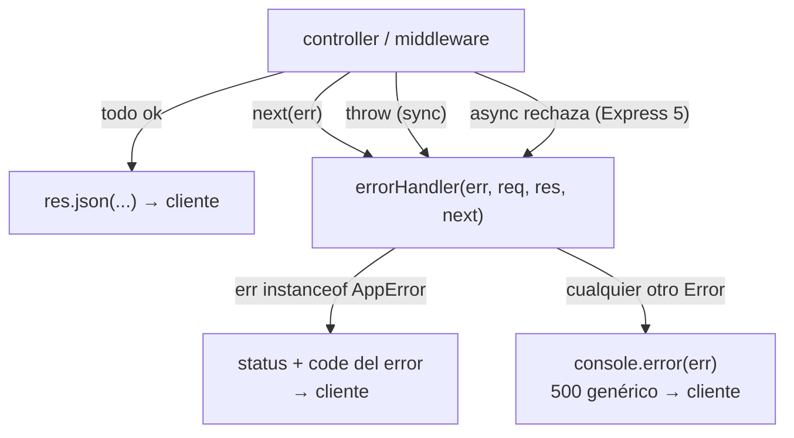
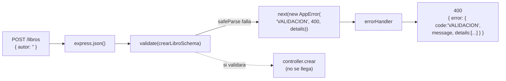

# Clase 6 — Validación con Zod y manejo de errores centralizado

## Objetivos de la clase

- Entender el **error handler** de Express: la firma de 4 parámetros, `next(err)`, y por qué juntar todo el manejo de errores en un solo lugar.
- Distinguir **errores esperados** (el cliente mandó algo mal) de **errores inesperados** (un bug nuestro).
- Aprender **Zod**: qué es, para qué sirve, cómo se define un schema y cómo se valida.
- Armar un **middleware de validación reutilizable** y enchufarlo en las rutas.

## 1. Dónde estamos

En la clase 5 partimos el CRUD en `routes/` + `controllers/`, y todos los errores quedaron con el mismo formato: `{ error: { code, message } }`. Pero para lograrlo, cada controller repite lo mismo:

```js
function obtener(req, res) {
  const libro = libros.find((l) => l.id === Number(req.params.id));
  if (!libro) {
    return res.status(404).json({ error: { code: "LIBRO_NO_ENCONTRADO", message: "..." } });
  }
  res.status(200).json(libro);
}
```

Y la validación del `POST` es un `if` a mano:

```js
if (!titulo || !autor) {
  return res.status(400).json({ error: { code: "DATOS_INCOMPLETOS", message: "..." } });
}
```

Dos problemas:

1. **El armado de la respuesta de error está desparramado.** Si mañana querés agregar un campo al formato (un `timestamp`, un `requestId`), tocás 8 lugares.
2. **La validación a mano no escala.** `if (!titulo)` no cubre: ¿y si `titulo` es un número? ¿y si `stock` es negativo? ¿y si mandan `stock: "tres"`? Cada regla nueva es otro `if`, y los mensajes salen inconsistentes.

Hoy resolvemos las dos cosas: **un solo lugar** para responder errores (el error handler), y **Zod** para la validación.

## 2. El error handler de Express

### 2.1 La firma de 4 parámetros

Un middleware normal tiene 3 parámetros: `(req, res, next)`. Un **error handler** tiene **4**: `(err, req, res, next)`. Express los distingue *por la cantidad de parámetros* — literalmente cuenta `fn.length`. Si escribís una función de 4 parámetros y la registrás con `app.use`, Express la trata como manejador de errores.

```js
// middlewares/errorHandler.js
function errorHandler(err, req, res, next) {
  console.error(err);
  res.status(500).json({ error: { code: "ERROR_INTERNO", message: "Algo salió mal" } });
}

export default errorHandler;
```

> **Regla de oro:** El `errorHandler` se registra al final de todo en `index.js`, después de todas las rutas y routers (`app.use(errorHandler)`).

### 2.2 Cómo llega un error al error handler (con `Error` nativo)

Express captura errores por tres vías:

1. **`next(err)`** — llamás a `next` pasando un argumento (ej: un `new Error()`). Express saltea todos los middlewares que falten y salta directo al error handler.
   ```js
   function obtener(req, res, next) {
     const libro = libros.find((l) => l.id === Number(req.params.id));
     if (!libro) {
       return next(new Error("No existe ese libro")); // Pasa el error nativo al handler
     }
     res.json(libro);
   }
   ```
2. **`throw` sincrónico** — si lanzás un error adentro de una función normal de Express, Express lo atrapa solo y se lo manda al error handler.
   ```js
   app.get("/probar-error", (req, res) => {
     throw new Error("boom"); // Express lo captura → errorHandler
   });
   ```
3. **Promesa rechazada en un handler `async`** — **desde Express 5**, si una función `async` lanza un error o rechaza una promesa, Express la envía automáticamente al error handler sin necesidad de escribir un `try/catch`.
   ```js
   app.get("/probar-async", async (req, res) => {
     const data = await consultarBaseDeDatos(); // Si rechaza → errorHandler (v5)
     res.json(data);
   });
   ```

#### El problema de usar solo `Error` nativo:

Con la función `new Error("...")` nativa de JS, **todos** los errores parecen iguales para el `errorHandler`. El manejador no sabe si la falla fue un 404 (el cliente buscó un ID inválido) o un 500 (se cayó la base de datos). Terminaríamos respondiendo `500` para cualquier problema.

---

### 2.3 La solución: Errores esperados vs inesperados (`AppError`)

Para responder con propiedad, debemos distinguir dos tipos de errores:

- **Inesperado (Bug):** Ocurrió una excepción no controlada (`libros` es `undefined`, fallo de conexión a DB, error de sintaxis). El cliente no tiene la culpa. Guardamos el log en consola y le devolvemos un **500** genérico (nunca exponemos el stack trace por seguridad).
- **Esperado (Regla de negocio / Cliente):** Sabemos que puede pasar: *"El libro no existe"* (404), *"Faltan campos obligatorios"* (400), *"El ISBN ya existe"* (409).

Para los errores esperados creamos nuestra propia clase que extiende de `Error` y le agrega un `statusCode` HTTP y un `code` string de negocio:

```js
// errors/AppError.js
class AppError extends Error {
  constructor(code, message, statusCode = 400, details = undefined) {
    super(message);
    this.name = "AppError";
    this.code = code;              // ej: "LIBRO_NO_ENCONTRADO"
    this.statusCode = statusCode;  // ej: 404
    this.details = details;        // opcional: detalles de validación
  }
}

export default AppError;
```

---

### 2.4 El `errorHandler` completo con `instanceof AppError`

Ahora que **`AppError` ya existe**, podemos actualizar nuestro `errorHandler` para que consulte con `instanceof` qué tipo de error recibió:

```js
// middlewares/errorHandler.js
import AppError from "../errors/AppError.js";

function errorHandler(err, req, res, next) {
  // Si es un error esperado de nuestra clase AppError
  if (err instanceof AppError) {
    return res.status(err.statusCode).json({
      error: {
        code: err.code,
        message: err.message,
        ...(err.details && { details: err.details }),
      },
    });
  }

  // Inesperado: bug. Log entero para los desarrolladores, respuesta vaga para el cliente.
  console.error("Error no controlado:", err);
  res.status(500).json({
    error: { code: "ERROR_INTERNO", message: "Ocurrió un error inesperado" },
  });
}

export default errorHandler;
```

#### ¿Cómo queda ahora un controller?

Ahora los controllers quedan limpios y libres de `res.status()` cuando hay errores:

```js
import AppError from "../errors/AppError.js";

function obtener(req, res, next) {
  const libro = libros.find((l) => l.id === Number(req.params.id));
  if (!libro) {
    return next(new AppError("LIBRO_NO_ENCONTRADO", "No existe ese libro", 404));
  }
  res.json(libro);
}
```



### 2.5 ¿Un `AppError` por entidad?

No. `AppError` es **una sola clase, genérica, para toda la app** — no se hace una `LibroError`, otra `CategoriaError`, otra `AutorError`. Lo que cambia entre un recurso y otro no es la clase, son los **datos** que le pasás al construirla:

```js
// para libros
next(new AppError("LIBRO_NO_ENCONTRADO", "No existe un libro con id 5", 404));

// para categorías
next(new AppError("CATEGORIA_NO_ENCONTRADA", "No existe una categoría con id 3", 404));

// para autores
next(new AppError("AUTOR_NO_ENCONTRADO", "No existe un autor con id 9", 404));
```

Misma clase, misma firma `(code, message, statusCode, details)` en los tres casos — solo cambia el string de `code` y el mensaje. El `errorHandler` (sección 2.4) no sabe ni le importa de qué recurso vino el error: hace `instanceof AppError` y arma la respuesta con lo que le pasaron. Esa es la gracia de tener un molde único para "error esperado", reusado por todos los recursos de la API.

Lo que sí conviene hacer, **por controller**, es un helper chiquito para no repetir el mensaje cada vez que buscás ese recurso por id:

```js
// controllers/librosController.js
const libroNoEncontrado = (id) =>
  new AppError("LIBRO_NO_ENCONTRADO", `No existe un libro con id ${id}`, 404);

function obtener(req, res, next) {
  const libro = libros.find((l) => l.id === Number(req.params.id));
  if (!libro) return next(libroNoEncontrado(req.params.id));
  res.json(libro);
}
```

```js
// controllers/categoriasController.js
const categoriaNoEncontrada = (id) =>
  new AppError("CATEGORIA_NO_ENCONTRADA", `No existe una categoría con id ${id}`, 404);
```

Ojo: `libroNoEncontrado` y `categoriaNoEncontrada` son **funciones normales que devuelven un `AppError`**, no subclases. Cada controller tiene las suyas, adaptadas a su entidad, pero todas terminan construyendo la misma clase.

> Si algún día tenés una entidad con una regla tan particular que necesita lógica propia (no solo un `code`/`message`/`statusCode` distintos), ahí podría justificarse extender `AppError`. Para este curso — y para la gran mayoría de APIs reales — con una sola clase alcanza y sobra.

---

## 3. Zod: validación de datos

### 3.1 Qué es y para qué sirve

**Zod** es una librería para **describir la forma que deberían tener unos datos** y después chequear si un valor cumple con esa forma. Se define un **schema** (el "molde") y se lo usa para validar lo que llega en `req.body`, `req.query`, `req.params`, o cualquier dato externo.

```bash
npm install zod
```

```js
import { z } from "zod";

const crearLibroSchema = z.object({
  titulo: z.string().min(1, "El título es obligatorio"),
  autor: z.string().min(1, "El autor es obligatorio"),
  isbn: z.string().optional(),
  stock: z.number().int().nonnegative().default(0),
});
```

### 3.2 Por qué no validar a mano

Lo que ese schema de arriba dice, escrito con `if`, serían ~12 líneas: chequear que cada campo exista, que sea del tipo correcto, que `stock` sea entero y no negativo, poner el default... y cada `if` con su mensaje escrito distinto. Zod lo hace declarativo, consistente, y en un solo lugar.

### 3.3 `parse` vs `safeParse`

```js
// parse: si NO valida, tira una excepción (ZodError)
const data = crearLibroSchema.parse(req.body);

// safeParse: nunca tira. Devuelve un objeto con el resultado.
const resultado = crearLibroSchema.safeParse(req.body);
if (resultado.success) {
  resultado.data;   // los datos ya validados (y con defaults aplicados, tipos convertidos)
} else {
  resultado.error;  // un ZodError con el detalle de qué falló
}
```

Vamos a usar **`safeParse`** en el middleware — es más fácil de controlar que un `try/catch`.

### 3.4 Lo que Zod devuelve no es lo mismo que lo que entró

`parse` y `safeParse` no solo dicen "sí, está bien" o "no, está mal": cuando la validación pasa, te devuelven **un objeto nuevo**, distinto del `req.body` original. Puede ser distinto en dos sentidos:

1. **Los campos con `.default(...)` que no vinieron aparecen con su valor por defecto.**
2. **Los campos con `z.coerce...` quedan convertidos al tipo correcto** (por ejemplo, el string `"10"` de la query pasa a ser el número `10` — lo vemos en la sección 3.8).

Un ejemplo concreto con el `crearLibroSchema` de arriba, para un `POST` donde el cliente no mandó ni `isbn` ni `stock`:

```js
// req.body ANTES de validar (lo que mandó el cliente):
{ titulo: "Rayuela", autor: "Cortázar" }

const resultado = crearLibroSchema.safeParse(req.body);

resultado.data;
// {
//   titulo: "Rayuela",
//   autor: "Cortázar",
//   stock: 0            // <- lo puso Zod, no vino en el body
// }
// (isbn ni siquiera aparece: era .optional() y no vino)
```

`req.body` y `resultado.data` **no son el mismo objeto ni tienen las mismas claves**: `resultado.data` es un objeto nuevo, creado por Zod, con los huecos ya completados. Si el controller siguiera leyendo el `req.body` original, ese `stock: 0` no existiría — el controller tendría que volver a poner el default a mano, exactamente lo que queríamos evitar.

Por eso, después de validar, **reemplazamos** `req.body` por el resultado, para que todo lo que venga después (el controller) trabaje siempre con la versión limpia:

```js
req.body = resultado.data; // de acá en más, el controller ve esto — no el body crudo del cliente
```

Este reemplazo lo hace el middleware `validate` (sección 4.1), así que ningún controller tiene que acordarse de hacerlo.

### 3.5 Tipos y validadores que vas a usar

| Código                            | Qué valida                                                                                          |
| ---------------------------------- | ---------------------------------------------------------------------------------------------------- |
| `z.string()`                     | Debe ser un string                                                                                   |
| `z.string().min(1).max(200)`     | String de entre 1 y 200 caracteres                                                                   |
| `z.string().email()`             | String con formato de email válido                                                                  |
| `z.string().regex(/^\d{13}$/)`   | String que matchea esa expresión regular (ej: ISBN de 13 dígitos)                                  |
| `z.number().int().positive()`    | Número entero positivo (mayor a 0)                                                                  |
| `z.number().int().nonnegative()` | Número entero mayor o igual a 0                                                                     |
| `z.boolean()`                    | `true` o `false`                                                                                 |
| `z.enum(["activo", "inactivo"])` | Solo uno de esos valores exactos, nada más                                                          |
| `z.array(z.string())`            | Un array donde cada elemento es un string                                                            |
| `z.object({ ... })`              | Un objeto con una forma fija (se puede anidar)                                                       |
| `.optional()`                    | El campo puede no venir (queda`undefined`)                                                         |
| `.default(valor)`                | Si no viene, se completa con`valor`                                                                |
| `.nullable()`                    | El campo puede ser explícitamente`null`                                                           |
| `z.coerce.number()`              | Convierte el valor a número*antes* de validarlo (ideal para query params, que llegan como string) |

Un ejemplo armando un schema con varios de estos a la vez, y probándolo con `safeParse` para ver qué devuelve en cada caso:

```js
const usuarioSchema = z.object({
  nombre: z.string().min(1, "El nombre es obligatorio"),
  edad: z.number().int().positive().optional(),
  rol: z.enum(["admin", "lector"]).default("lector"),
});

usuarioSchema.safeParse({ nombre: "Ana", edad: 30 });
// { success: true, data: { nombre: "Ana", edad: 30, rol: "lector" } }
//                                                     ^ default aplicado, rol no vino

usuarioSchema.safeParse({ nombre: "", edad: -5, rol: "root" });
// { success: false, error: ZodError con 3 issues: nombre (vacío), edad (negativo), rol (no es "admin" ni "lector") }
```

### 3.6 El schema completo: reusar campos entre crear y actualizar

En la práctica no alcanza con un solo schema: `POST /libros` (crear) y `PUT /libros/:id` (actualizar) necesitan reglas parecidas pero no iguales. Un update puede mandar solo el campo que cambia (`{ "stock": 5 }`), así que ahí **todos los campos son opcionales** — y a `stock` especialmente **no le podemos poner `.default(0)`**, porque si el cliente no lo manda, no queremos pisar el stock que ya tenía el libro con un `0`.

La forma prolija de resolver esto es definir cada campo **una sola vez**, en un objeto aparte, y armar los dos schemas reusando esas piezas:

```js
// schemas/libroSchema.js
import { z } from "zod";

// Cada campo se define una única vez, con sus reglas y sus mensajes.
const campos = {
  titulo: z.string({ error: "El título es obligatorio" }).min(1, "El título no puede estar vacío"),
  autor: z.string({ error: "El autor es obligatorio" }).min(1, "El autor no puede estar vacío"),
  isbn: z.string().optional(),
  stock: z
    .number({ error: "El stock debe ser un número" })
    .int("El stock debe ser un número entero")
    .nonnegative("El stock no puede ser negativo"),
};

// POST /libros — titulo y autor obligatorios, isbn opcional, stock con default
const crearLibroSchema = z.object({
  titulo: campos.titulo,
  autor: campos.autor,
  isbn: campos.isbn,
  stock: campos.stock.default(0),
});

// PUT /libros/:id — es un update: todo opcional, y stock SIN default
// (si el update no manda stock, no lo queremos pisar con 0)
const actualizarLibroSchema = z.object({
  titulo: campos.titulo.optional(),
  autor: campos.autor.optional(),
  isbn: campos.isbn,
  stock: campos.stock.optional(),
});

export { crearLibroSchema, actualizarLibroSchema };
```

> **¿Por qué no `crearLibroSchema.partial()`?** Zod trae un método `.partial()` que vuelve opcionales todos los campos de un schema existente, y da la tentación de escribir `const actualizarLibroSchema = crearLibroSchema.partial()` en una sola línea. El problema es que **el `.default(0)` de `stock` se sigue aplicando** aunque el campo no venga, porque el default se resuelve antes de que importe si el campo es opcional. Entonces `actualizarLibroSchema.safeParse({ stock: 5 })` andaría bien, pero `actualizarLibroSchema.safeParse({ titulo: "Nuevo título" })` (sin tocar `stock`) devolvería `{ titulo: "Nuevo título", stock: 0 }` — y ese `stock: 0` terminaría pisando el stock real del libro en el `actualizar` del controller. Por eso definimos `actualizarLibroSchema` a mano, reusando los `campos` pero **sin** el `.default(0)`.

Con el `resultado.data` de este schema (sección 3.4) ya sabemos que **solo van a estar presentes los campos que el schema define** — nada extra que haya mandado el cliente se cuela.

### 3.7 El `ZodError` por dentro

Cuando la validación falla, el error trae un array `issues`, uno por cada regla incumplida:

```js
resultado.error.issues
// [
//   { path: ["titulo"], message: "El título no puede estar vacío", code: "too_small", ... },
//   { path: ["stock"],  message: "El stock no puede ser negativo",  code: "too_small", ... }
// ]
```

- `path` — qué campo falló (array, porque puede ser anidado: `["direccion", "calle"]`).
- `message` — el texto (el que vos pusiste, o el default de Zod).

Eso es justo lo que queremos mandar en el `details` del error — lo armamos en la sección 4.1.

### 3.8 Query params: `z.coerce`

Todo lo de `req.query` llega como **string** (`"10"`, no `10`). Para validar números en la query, Zod tiene `coerce`, que convierte antes de validar:

```js
const paginacionSchema = z.object({
  page: z.coerce.number().int().positive().default(1),
  limit: z.coerce.number().int().positive().max(100).default(20),
});

paginacionSchema.safeParse({ page: "2", limit: "10" });
// { success: true, data: { page: 2, limit: 10 } }   <- ya son números, no strings

paginacionSchema.safeParse({});
// { success: true, data: { page: 1, limit: 20 } }   <- defaults, ninguno vino
```

> **Ojo con Express 5**: `req.query` pasó a ser de **solo lectura** — no podés hacer `req.query = resultado.data`. Guardá el resultado en otra propiedad (`req.paginacion = resultado.data`) o leelo directo en el controller. `req.body` sí se puede reasignar.

### 3.9 Lo que Zod NO valida: inyección SQL y XSS

Zod valida **la forma** de los datos (tipo, longitud, si es obligatorio) — no si el contenido es peligroso para lo que hagas con él después. Son dos problemas distintos y conviene no confundirlos.

```js
crearLibroSchema.safeParse({
  titulo: "'; DROP TABLE libros; --",
  autor: "Ana",
  stock: 3,
});
// { success: true, ... }  <- ¡pasa perfecto! Es un string válido de más de 1 carácter.
```

Zod no tiene forma de saber que ese `titulo` va a terminar pegado dentro de una consulta SQL armada a mano más adelante. El problema de la inyección no está en la forma del dato, está en **cómo se usa ese string después**:

- **SQL injection** se evita en la capa que arma la query — con **queries parametrizadas** (`$1`, `?`) o un ORM/query builder (Prisma, Sequelize, Knex), nunca concatenando strings. Ahí el string se guarda tal cual, como dato inofensivo, sin importar qué caracteres tenga. Esto lo vemos en las clases de la capa de DAO/base de datos.
- **XSS** se evita al **renderizar** (escapando el HTML donde se muestra ese dato), no al validar la entrada.

> **¿Y bloquear caracteres especiales con una regex en el schema, como defensa?** No es un buen camino: 1) rompe datos legítimos (`O'Brien`, títulos con guiones o tildes), y 2) es una lista negra siempre incompleta — un ataque de SQL injection no necesita comillas ni `;` para funcionar. Un regex en Zod tiene sentido para reglas de **negocio** del dato (ej: `isbn` con exactamente 13 dígitos), no como filtro anti-inyección.

Donde sí ayuda Zod, aunque sea de rebote: por default `z.object({...})` **descarta cualquier clave que no esté declarada en el schema**. Si a `crearLibroSchema` (que solo tiene `titulo`, `autor`, `isbn`, `stock`) le mandan `{ titulo: "X", autor: "Y", isAdmin: true }`, el `isAdmin` desaparece de `resultado.data` — nunca llega al controller. Eso sí es protección real contra "mass assignment" (que se cuele un campo que el cliente no debería poder tocar), pero es un beneficio distinto de la inyección SQL, y no la reemplaza.

## 4. Middleware de validación reutilizable

### 4.1 El middleware `validate`

En vez de meter Zod adentro de cada controller, lo hacemos **una vez**, como middleware que recibe el schema:

```js
// middlewares/validate.js
import AppError from "../errors/AppError.js";

function validate(schema) {
  return (req, res, next) => {
    const resultado = schema.safeParse(req.body);

    if (!resultado.success) {
      const details = resultado.error.issues.map((issue) => ({
        campo: issue.path.join(".") || "(raíz)",
        mensaje: issue.message,
      }));
      return next(new AppError("VALIDACION", "Datos inválidos", 400, details));
    }

    req.body = resultado.data; // reemplazo del que habla la sección 3.4: datos limpios de acá en más
    next();
  };
}

export default validate;
```

`validate` es una **función que devuelve un middleware** (una *factory*). Le pasás un schema (`crearLibroSchema`, `actualizarLibroSchema`, el que sea) y te da de vuelta una función `(req, res, next)` lista para enchufar en una ruta.

### 4.2 Enchufarlo en las rutas

Acá se ve la ventaja de haber separado en `routes/` la clase pasada: la validación se declara al lado de la ruta, antes del controller.

```js
// routes/librosRoutes.js
import validate from "../middlewares/validate.js";
import { crearLibroSchema, actualizarLibroSchema } from "../schemas/libroSchema.js";

router.post("/", validate(crearLibroSchema), controller.crear);
router.put("/:id", validate(actualizarLibroSchema), controller.actualizar);
```

Cuando llega un `POST /libros`, la fila es: `logger → express.json() → validate(crearLibroSchema) → controller.crear`. Si la validación falla, `validate` llama a `next(err)` y el `controller.crear` **nunca se ejecuta** — el error salta directo al error handler.

## 5. El flujo completo de un error de validación



Respuesta final al cliente:

```json
{
  "error": {
    "code": "VALIDACION",
    "message": "Datos inválidos",
    "details": [
      { "campo": "titulo", "mensaje": "El título es obligatorio" },
      { "campo": "autor", "mensaje": "El autor es obligatorio" }
    ]
  }
}
```

## 6. `index.js`: dónde va cada pieza

Con todo lo nuevo de esta clase, `biblioteca-api-express/` queda así:

```
biblioteca-api-express/
├── index.js
├── data/libros.js
├── errors/
│   └── AppError.js              ← nuevo (2.3)
├── schemas/
│   └── libroSchema.js           ← nuevo (3.6)
├── routes/
│   └── librosRoutes.js          ← ahora enchufa validate(...) (4.2)
├── controllers/
│   └── librosController.js      ← usa next(new AppError(...)) en vez de res.status() (2.5)
└── middlewares/
    ├── logger.js                ← de la clase 5
    ├── notFound.js               ← de la clase 5
    ├── validate.js               ← nuevo (4.1)
    └── errorHandler.js           ← nuevo (2.4)
```

`errors/` y `schemas/` son carpetas nuevas de esta clase. Todo lo demás ya existía desde la 5 y se modifica, no se recrea. Y `index.js` es el único lugar donde todas estas piezas se enchufan entre sí:

```js
import express from "express";
import logger from "./middlewares/logger.js";
import notFound from "./middlewares/notFound.js";
import errorHandler from "./middlewares/errorHandler.js";
import librosRoutes from "./routes/librosRoutes.js";

const app = express();

app.use(logger);
app.use(express.json());

app.use("/libros", librosRoutes); // las rutas usan validate(...) adentro

app.use(notFound);       // ninguna ruta matcheó (404)
app.use(errorHandler);   // SIEMPRE el último: atrapa todo lo que llegó por next(err) o throw
```

El orden no es negociable: `errorHandler` va después de **todo**, porque su trabajo es recibir lo que los demás le pasaron.

## Cierre

Ya tenés el manejo de errores de una API real: una clase `AppError` para los errores esperados, un `errorHandler` central que arma la respuesta en un solo lugar y distingue bug de error de negocio, y Zod + un middleware `validate` reutilizable para que a los controllers les lleguen datos ya limpios. De la clase 7 en adelante entra la arquitectura en capas: sacar la lógica de negocio de los controllers hacia *casos de uso*.
