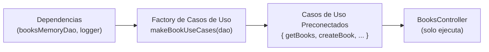

# Clase 8 — Patrón DAO / Repository y Factories: Inyección de Dependencias Manual

## Objetivos de la clase

- Comprender en profundidad las diferencias entre el patrón **DAO (Data Access Object)** y el **Repository Pattern**.
- Identificar el problema de ergonomía y acoplamiento al pasar dependencias manualmente en cada llamada.
- Entender qué es el patrón **Factory (Fábrica)** y cómo automatizar la creación e inyección de dependencias en Node.js puro.
- Implementar una **Factory de Casos de Uso** que encapsule las dependencias y devuelva funciones o servicios listos para ser consumidos.
- Refactorizar el controlador para que no conozca ningún DAO, interactuando únicamente con los casos de uso configurados.
- Dejar el proyecto 100% preparado para la Clase 9 (donde intercambiaremos el motor de persistencia por Sequelize sin modificar la lógica de negocio ni la capa HTTP).

---

## 1. Dónde estamos y cuál es el problema actual

En la clase 7 logramos un hito fundamental: **extrajimos la lógica de negocio del controlador** y la movimos a casos de uso independientes (`getBooks`, `getBookById`, `createBook`, `updateBook`, `deleteBook`), creando además el puerto `booksMemoryDao.js`.

Sin embargo, si miramos nuestro controlador actual ([booksController.js](file:///Users/osvaldoojeda/Desktop/clases_node/osvaldo/clases/7_clase/controllers/booksController.js)):

```js
// controllers/booksController.js — Situación de la clase 7
import dao from "../dao/booksMemoryDao.js";
import getBooks from "../usecases/books/getBooks.js";
import createBook from "../usecases/books/createBook.js";

class BooksController {
  #dao;

  constructor(daoDependency = dao) {
    this.#dao = daoDependency;
  }

  list = async (req, res) => {
    const books = await getBooks(req.query, this.#dao); // ← Hay que pasar this.#dao en cada llamada
    res.json(books);
  };

  create = async (req, res) => {
    const book = await createBook(req.body, this.#dao); // ← Otra vez pasando este argumento
    res.status(201).json(book);
  };
}
```

### El problema de ergonomía y mantenimiento

1. **Repetición constante:** En cada handler del controlador tenemos que estar pasando explícitamente `this.#dao` como argumento al caso de uso.
2. **El controlador conoce los detalles del negocio:** El controlador sabe que `createBook` o `getBooks` necesitan un DAO para funcionar. Si mañana `createBook` necesita además un servicio de email (`mailer`) y un registrador de auditoría (`logger`), tendríamos que cambiar la firma a `createBook(req.body, this.#dao, this.#mailer, this.#logger)` y actualizar el controlador.
3. **Acoplamiento residual:** El controlador sigue importando el DAO por defecto `import dao from "../dao/booksMemoryDao.js"`.

**La pregunta clave es:** ¿Cómo logramos que el controlador invoque casos de uso que ya tengan sus dependencias "preconectadas" o "enchufadas", de modo que el controlador solo llame a `useCases.create(req.body)`?

---

## 2. El Patrón DAO / Repository en profundidad

Antes de resolver las factories, aclaremos la diferencia teórica entre dos patrones que a menudo se usan como sinónimos: **DAO** y **Repository**.

```
┌─────────────────────────────────────────────────────────────────┐
│                        CASO DE USO                              │
└───────────────────────────────┬─────────────────────────────────┘
                                │
                 ┌──────────────┴──────────────┐
                 ▼                             ▼
   ┌───────────────────────────┐ ┌───────────────────────────┐
   │     Patrón REPOSITORY     │ │        Patrón DAO         │
   │  (Colección de Dominio)   │ │   (Acceso a Datos SQL/BD) │
   └─────────────┬─────────────┘ └─────────────┬─────────────┘
                 │                             │
                 ▼                             ▼
      Entidades de Dominio            Tablas / Filas / JSON
```

### DAO (Data Access Object)

* **Enfoque:** Orientado a la base de datos y al acceso de datos crudo.
* **Propósito:** Abstraer las consultas SQL, llamadas a ORMs o lectura de archivos JSON.
* **Vocabulario:** Métodos relacionados a tablas o registros (`insert`, `update`, `delete`, `findByIsbn`).
* **Uso típico:** Proyectos medianos en Node.js, microservicios o apis Express directas.

### Repository

* **Enfoque:** Orientado al Dominio (Domain-Driven Design - DDD).
* **Propósito:** Simular que los datos viven en una colección gigante en memoria de objetos de dominio.
* **Vocabulario:** Métodos orientados a la colección (`add`, `remove`, `findMatching`).
* **Uso típico:** Arquitecturas limpias complejas con modelos de dominio ricos.

> **En este curso:** Usamos la nomenclatura **DAO** porque nuestro adaptador abstrae las operaciones CRUD fundamentales de persistencia de manera directa e intuitiva.

---

### ¿Qué es el "Dominio" (Domain) en palabras simples?

Para entender por qué separamos **DAO** (o **Repository**) de los **Casos de Uso**, primero hay que entender qué es el **Dominio del Negocio**:

> **El Dominio son las reglas del problema del mundo real que resuelve tu sistem a, independientemente de la tecnología utilizada.**

Pensalo con un ejemplo sin computadoras:
Imaginá una **biblioteca física de papel** manejada con ficheros. Las reglas del negocio son:

* *"Un libro con stock 0 no se puede prestar."*
* *"No pueden registrarse dos libros con el mismo código ISBN."*
* *"El stock no puede ser un número negativo."*

Esas reglas forman el **DOMINIO**. Existen exactamente igual si la biblioteca usa un fichero de papel, un cuaderno viejo o un servidor en la nube con Express y MySQL.

#### ¿Qué NO es Dominio? (Infraestructura / Tecnología)

Express, HTTP 200/404, Zod, `req.body`, `res.json()`, MySQL, Sequelize o un Arreglo JS. Todo eso es **Infraestructura** (las herramientas tecnológicas que usás para mostrar o guardar los datos).

#### En nuestra arquitectura por capas:

1. **Capa HTTP / Controladores (`routes/`, `controllers/`):** Maneja el protocolo web (`req`, `res`, respuestas JSON, esquemas Zod).
2. **Capa de Dominio / Casos de Uso (`usecases/`):** Ejecuta las reglas de negocio reales (*"Verificar que el ISBN no esté duplicado"*).
3. **Capa de Persistencia / DAO (`dao/`):** Guarda y recupera los datos (en memoria o en la base de datos).

---

## 3. Patrón Factory: ¿Qué es y qué problema resuelve?

Una **Factory (Fábrica)** es un patrón de diseño creacional cuyo objetivo es **encapsular la lógica de instanciación o construcción de objetos**.

En lugar de construir un objeto manualmente en múltiples partes de la aplicación haciendo `new Objeto(dep1, dep2, dep3)`, le pedimos a la Factory que lo construya por nosotros.


```mermaid
flowchart LR
    Deps["Dependencias\n(booksMemoryDao, logger)"] --> Factory["Factory de Casos de Uso\nmakeBookUseCases(dao)"]
    Factory --> UC["Casos de Uso Preconectados\n{ getBooks, createBook, ... }"]
    UC --> Controller["BooksController\n(solo ejecuta)"]
```

*(si tu editor no renderiza Mermaid, instalá la extensión "Markdown Preview Mermaid Support" en VSCode, o mirá el archivo directamente en GitHub)*

### ¿Por qué usaremos una Factory para los Casos de Uso?

Queremos que la Factory reciba las dependencias **una sola vez** al iniciar la aplicación (en el arranque) y devuelva un objeto con todos los casos de uso ya listos para usar, sin que el controlador tenga que preocuparse por pasar el `dao`.

---

## 4. Implementación de una Factory en JavaScript

En JavaScript tenemos dos formas principales de implementar este patrón de manera limpia:

### Enfoque A: Mediante funciones de orden superior y clausuras (Closures) — Recomendado

Aprovechando que en JS las funciones son ciudadanos de primer orden y pueden retornar objetos con funciones cerradas sobre sus variables (*closures*):

```js
// usecases/books/makeBookUseCases.js
import getBooks from "./getBooks.js";
import getBookById from "./getBookById.js";
import createBook from "./createBook.js";
import updateBook from "./updateBook.js";
import deleteBook from "./deleteBook.js";

/**
 * Factory que recibe las dependencias e inyecta el DAO en cada caso de uso.
 * Retorna un objeto con métodos que solo reciben los datos del request.
 */
function makeBookUseCases(dao) {
  return {
    getBooks: (filters) => getBooks(filters, dao),
    getBookById: (id) => getBookById(id, dao),
    createBook: (data) => createBook(data, dao),
    updateBook: (id, changes) => updateBook(id, changes, dao),
    deleteBook: (id) => deleteBook(id, dao),
  };
}

export default makeBookUseCases;
```

#### ¿Qué sucede aquí?

Cuando la aplicación arranca, ejecutamos `makeBookUseCases(booksMemoryDao)`. El objeto resultante contiene métodos como `createBook(data)`. La variable `dao` queda "atrapada" en el *closure* de la función. El controlador ya no necesita saber qué es un DAO.

---

### Enfoque B: Mediante una clase contenedora de servicios

También es común agruparlos dentro de una clase `BookService` o `BookUseCasesContainer`:

```js
// usecases/books/BookUseCases.js
export class BookUseCases {
  #dao;

  constructor(dao) {
    this.#dao = dao;
  }

  getBooks(filters) { return getBooks(filters, this.#dao); }
  getBookById(id) { return getBookById(id, this.#dao); }
  createBook(data) { return createBook(data, this.#dao); }
  updateBook(id, changes) { return updateBook(id, changes, this.#dao); }
  deleteBook(id) { return deleteBook(id, this.#dao); }
}
```

Ambos enfoques son completamente válidos. El **Enfoque A (función factory con closures)** es el más idiómatico en Node.js funcional por su ligereza.

---

## 5. El Punto de Ensamblado (Composition Root)

Un principio clave en la arquitectura limpia es el concepto de **Composition Root (Raíz de Composición)**:

> **El Composition Root es el único lugar de la aplicación donde se instancian y conectan los componentes concretos.**

Típicamente, esto ocurre en el archivo de entrada (`index.js`) o en un archivo de configuración de dependencias (`container.js` / `dependencies.js`).

### Diagrama del flujo de composición:

```
[1. index.js]
     │
     ├── 2. Instancia / Importa: booksMemoryDao
     │
     ├── 3. Llama a: makeBookUseCases(booksMemoryDao)
     │        └── Retorna: bookUseCases (con el DAO ya inyectado)
     │
     └── 4. Pasa bookUseCases al Router / Controller
              └── Controller listo para responder HTTP
```

---

## 6. El Controller después del refactor con Factory

Así se ve nuestro `booksController.js` al usar la Factory de casos de uso:

```js
// controllers/booksController.js
import AppError from "../errors/AppError.js";

class BooksController {
  #useCases;

  constructor(useCases) {
    this.#useCases = useCases;
  }

  list = async (req, res) => {
    const books = await this.#useCases.getBooks(req.query);
    res.json(books);
  };

  get = async (req, res) => {
    const book = await this.#useCases.getBookById(Number(req.params.id));
    if (!book) throw new AppError("BOOK_NOT_FOUND", "No existe un libro con ese id", 404);
    res.json(book);
  };

  create = async (req, res) => {
    const book = await this.#useCases.createBook(req.body);
    res.status(201).json(book);
  };

  update = async (req, res) => {
    const book = await this.#useCases.updateBook(Number(req.params.id), req.body);
    if (!book) throw new AppError("BOOK_NOT_FOUND", "No existe un libro con ese id", 404);
    res.json(book);
  };

  remove = async (req, res) => {
    const deleted = await this.#useCases.deleteBook(Number(req.params.id));
    if (!deleted) throw new AppError("BOOK_NOT_FOUND", "No existe un libro con ese id", 404);
    res.status(204).send();
  };
}

export default BooksController;
```

### Notá la diferencia fundamental:

1. **El controlador ya no importa ningún DAO.**
2. **El controlador no pasa `dao` en ninguna llamada.**
3. El controlador solo conoce a los casos de uso (`this.#useCases`).
4. La firma de los casos de uso leídos desde el controlador es pura: `createBook(data)`, `getBookById(id)`.

---

## 7. La antesala a la Clase 9: Persistencia Intercambiable

En la Clase 9 integraremos **Sequelize (SQL)** como segundo adaptador de base de datos. Gracias al trabajo realizado hoy con las factories y la inyección de dependencias, cambiar de base de datos en toda la aplicación requerirá modificar **únicamente 2 líneas en el arranque (`index.js`)**:

```js
// index.js (Vista previa de la Clase 9)
import booksMemoryDao from "./dao/booksMemoryDao.js";
import booksSqlDao from "./dao/booksSqlDao.js"; // Nuevo adaptador Sequelize
import makeBookUseCases from "./usecases/books/makeBookUseCases.js";

// Selección dinámica del adaptador según variable de entorno
const dao = process.env.PERSISTENCE === "sql" ? booksSqlDao : booksMemoryDao;

// La factory empaqueta el DAO seleccionado
const bookUseCases = makeBookUseCases(dao);

// El controlador recibe los casos de uso sin enterarse de qué BD se está usando
const booksController = new BooksController(bookUseCases);
```

**Resultado:** Se cambia de un array en memoria a una base de datos MySQL/PostgreSQL **sin tocar ni una sola línea de código en los controladores ni en los casos de uso.**

---

## 8. Aclaraciones frecuentes

### ¿Por qué no usamos un contenedor IoC como NestJS o TSyringe?

En frameworks grandes de TypeScript como NestJS, se usan decoradores (`@Injectable()`, `@Inject()`) para que el framework inyecte las dependencias de manera automática.

En este curso utilizamos **Node.js idiómático puro (sin librerías adicionales)** para comprender la mecánica real de la Inyección de Dependencias. Entender cómo funcionan las Factories y la Inyección Manual garantiza que puedas trabajar en cualquier proyecto JavaScript o TypeScript, con o sin frameworks.

---

## Cierre

Hoy dimos un salto de calidad decisivo en la arquitectura:

1. Entendimos la responsabilidad del patrón DAO/Repository.
2. Eliminamos la repetición de pasar dependencias manualmente en cada llamada usando una **Factory de Casos de Uso**.
3. Logramos que el controlador esté totalmente desacoplado de la infraestructura.

En la **consigna práctica de la Clase 8**, crearemos la factory `makeBookUseCases.js`, actualizaremos el controlador y ensamblaremos el proyecto en el arranque.
